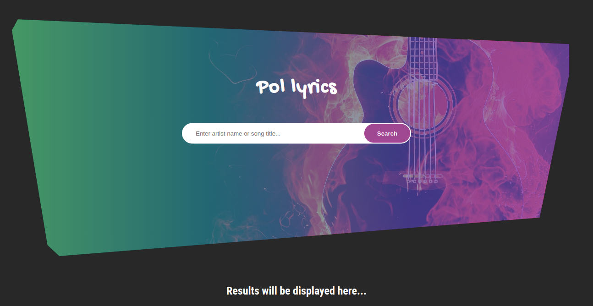
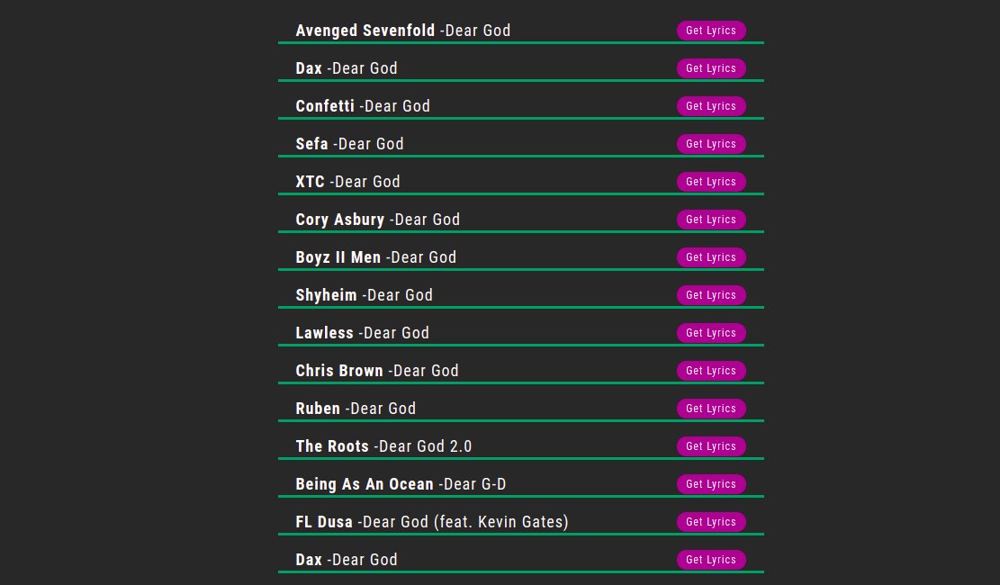
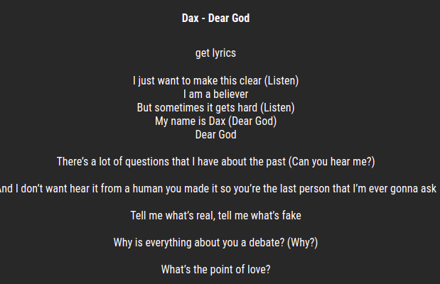

Documentation

Project Name: POL Lyrics, \n
Authour: Mutemip

Description

-> This is a project developed to help music lovers to search for Misic Lyrics and be able to follow along. 
	->The project consumes https://api.lyrics.ovh API which makes it easy to search songs and send back lyrics.
-> The project makes it easy for users to to search Music by either artist or song title and be able to render results. 
-> The interface has a search bar input field and a search button.
-> After searching, a list of songs are listed below where the user can click on "Get Lyrics" button and the lyrics is displayed.

Here is a live link to the project: https://mutemip.github.io/pol-lyrics-phase1/

Here is the Interface of the project:

Landing page:
./src/images/landing-page.png

Songs List After Search

Song Lyrics after clicking "Get Lyrics" Button

